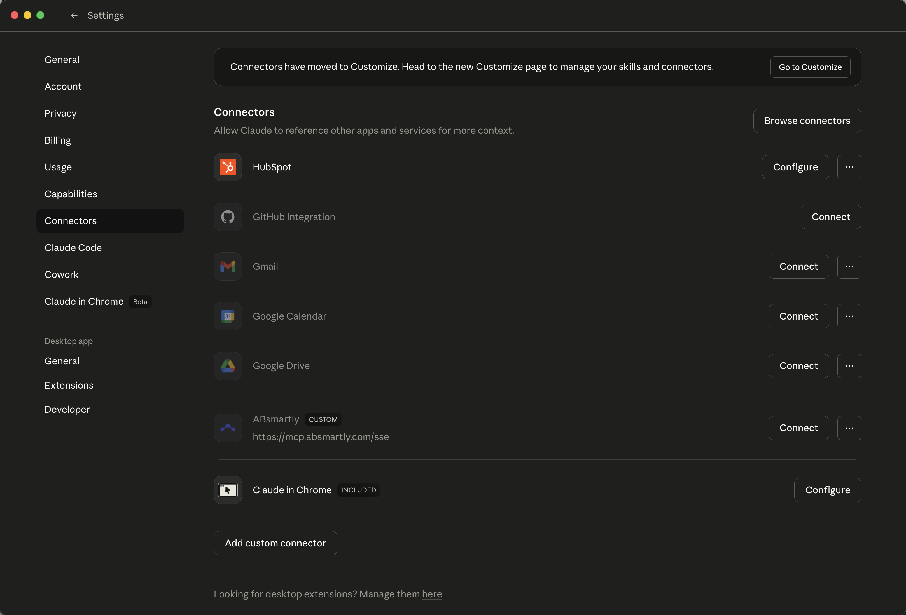
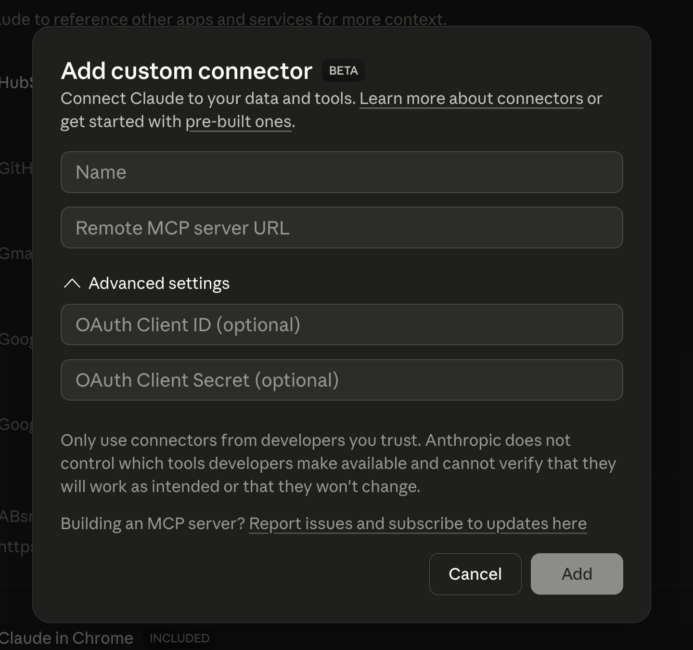
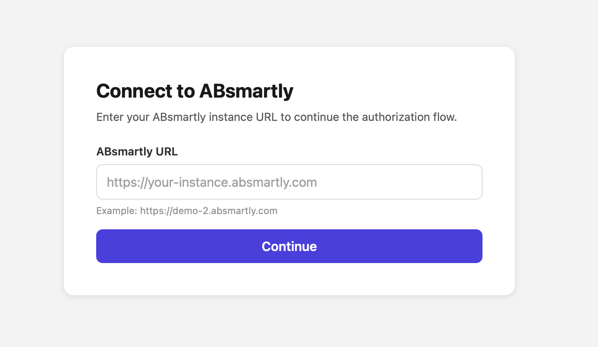

# ABsmartly MCP Server

A [Model Context Protocol](https://modelcontextprotocol.io/) server that provides full access to the ABsmartly experimentation platform through the CLI core library — 230+ commands across 33 groups including experiment lifecycle, metrics, goals, teams, and more.

### Quick install for Claude Desktop

[](https://mcp.absmartly.com/absmartly-mcp.dxt)

Download and double-click the file to install. For other clients (Cursor, VS Code, Windsurf, ChatGPT, Claude Code), see [Setup](#setup) below.

## How It Works

The server exposes 4 tools that give AI assistants access to the full ABsmartly CLI:

| Tool | Purpose |
|------|---------|
| `discover_commands` | Browse command groups or search by keyword |
| `get_command_docs` | Get detailed docs for a specific command |
| `execute_command` | Execute any command with typed parameters |
| `get_auth_status` | Check authentication status |

```
"What experiments are running?"
  → discover_commands(group: "experiments")
  → execute_command(group: "experiments", command: "listExperiments", params: {state: "running"})
```

---

## Setup

### Authentication Methods

The MCP server supports two authentication methods:

| Method | Best for | How it works |
|--------|----------|--------------|
| **API Key** | Programmatic access, CI/CD, headless | Pass key in headers or CLI config |
| **OAuth** | Interactive use in Claude Desktop/web | Browser-based login via ABsmartly SAML |

### Option 1: Claude Desktop

#### With OAuth (recommended)

Open **Settings → Connectors**, scroll to the bottom, and click **Add custom connector**:



In the dialog, give the connector a **Name** (e.g. "ABsmartly") and paste the URL into **Remote MCP server URL**:



**URL:**
```
https://mcp.absmartly.com/sse?absmartly-endpoint=https://your-instance.absmartly.com
```

Click **Add**, then **Connect**. Claude Desktop will open your browser for ABsmartly login (SAML/credentials). After authentication, the MCP connection is established automatically.

> The `absmartly-endpoint` query parameter is optional. If omitted, the OAuth flow will prompt you to enter the URL of your ABsmartly instance in the browser before login:
>
> 

#### With API Key

Pass the API key directly in the URL — no `mcp-remote` bridge needed:

**URL:**
```
https://mcp.absmartly.com/sse?api_key=YOUR_API_KEY&absmartly-endpoint=https://your-instance.absmartly.com
```

#### With API Key (via mcp-remote)

If you'd rather pass the key via headers instead of the URL, use the `mcp-remote` bridge — Claude Desktop doesn't support custom headers natively for remote servers:

**`~/Library/Application Support/Claude/claude_desktop_config.json`** (macOS):
```json
{
  "mcpServers": {
    "absmartly": {
      "command": "npx",
      "args": [
        "mcp-remote@latest",
        "https://mcp.absmartly.com/sse",
        "--header", "Authorization:YOUR_API_KEY",
        "--header", "x-absmartly-endpoint:https://your-instance.absmartly.com"
      ]
    }
  }
}
```

#### With Local Server (stdio)

Uses your ABsmartly CLI config and macOS Keychain credentials:

```json
{
  "mcpServers": {
    "absmartly": {
      "command": "npx",
      "args": ["@absmartly/mcp", "--profile=production"]
    }
  }
}
```

### Option 2: Claude Code

#### Remote with API Key

```bash
claude mcp add --transport sse --scope user absmartly \
  https://mcp.absmartly.com/sse \
  -H "Authorization:YOUR_API_KEY" \
  -H "x-absmartly-endpoint:https://your-instance.absmartly.com"
```

**Subdomain shorthand** — auto-constructs `https://<subdomain>.absmartly.com/v1`:
```bash
claude mcp add --transport sse --scope user absmartly \
  https://mcp.absmartly.com/sse \
  -H "Authorization:my-subdomain YOUR_API_KEY"
```

#### Remote with API Key (Streamable HTTP — recommended for new installs)

```bash
claude mcp add --transport http --scope user absmartly \
  https://mcp.absmartly.com/mcp \
  -H "Authorization:YOUR_API_KEY" \
  -H "x-absmartly-endpoint:https://your-instance.absmartly.com"
```

> Streamable HTTP is the modern MCP transport (the MCP spec deprecated SSE in March 2025). The `/sse` URL still works for older clients.

#### Remote with OAuth

```bash
claude mcp add --transport sse --scope user absmartly \
  "https://mcp.absmartly.com/sse?absmartly-endpoint=https://your-instance.absmartly.com"
```

Then run `/mcp` in Claude Code to authenticate when prompted. The `absmartly-endpoint` query parameter is optional — omit it and the OAuth flow will prompt you for the instance URL in the browser.

#### Local Server (stdio)

```bash
claude mcp add --scope user absmartly -- npx @absmartly/mcp --profile=production
```

#### Project Config (`.mcp.json`)

```json
{
  "mcpServers": {
    "absmartly": {
      "type": "sse",
      "url": "https://mcp.absmartly.com/sse",
      "headers": {
        "Authorization": "YOUR_API_KEY",
        "x-absmartly-endpoint": "https://your-instance.absmartly.com"
      }
    }
  }
}
```

Use `--scope project` instead of `--scope user` to write to `.mcp.json` (shared via VCS).

### Option 3: Cursor

[](cursor://anysphere.cursor-deeplink/mcp/install?name=absmartly&config=eyJ1cmwiOiJodHRwczovL21jcC5hYnNtYXJ0bHkuY29tL3NzZSJ9)

Click the badge above to install with one click (OAuth). After Cursor prompts you for the ABsmartly instance URL in the browser, the flow completes automatically. Or configure manually:

#### With API Key

**`.cursor/mcp.json`** (project) or **`~/.cursor/mcp.json`** (global):
```json
{
  "mcpServers": {
    "absmartly": {
      "url": "https://mcp.absmartly.com/sse",
      "headers": {
        "Authorization": "YOUR_API_KEY",
        "x-absmartly-endpoint": "https://your-instance.absmartly.com"
      }
    }
  }
}
```

**Or with Streamable HTTP transport (modern, recommended):**

```json
{
  "mcpServers": {
    "absmartly": {
      "type": "http",
      "url": "https://mcp.absmartly.com/mcp",
      "headers": {
        "Authorization": "YOUR_API_KEY",
        "x-absmartly-endpoint": "https://your-instance.absmartly.com"
      }
    }
  }
}
```

#### With OAuth

```json
{
  "mcpServers": {
    "absmartly": {
      "url": "https://mcp.absmartly.com/sse?absmartly-endpoint=https://your-instance.absmartly.com"
    }
  }
}
```

Cursor will detect the OAuth requirement and open your browser for login. The `absmartly-endpoint` query parameter is optional — omit it and the OAuth flow will prompt for the instance URL.

#### Local Server (stdio)

```json
{
  "mcpServers": {
    "absmartly": {
      "command": "npx",
      "args": ["@absmartly/mcp", "--profile=production"]
    }
  }
}
```

### Option 4: Windsurf

**`~/.codeium/windsurf/mcp_config.json`**:

#### With API Key

```json
{
  "mcpServers": {
    "absmartly": {
      "serverUrl": "https://mcp.absmartly.com/sse",
      "headers": {
        "Authorization": "YOUR_API_KEY",
        "x-absmartly-endpoint": "https://your-instance.absmartly.com"
      }
    }
  }
}
```

> Note: Windsurf uses `"serverUrl"` instead of `"url"`.

**Or with Streamable HTTP transport:**

```json
{
  "mcpServers": {
    "absmartly": {
      "serverUrl": "https://mcp.absmartly.com/mcp",
      "headers": {
        "Authorization": "YOUR_API_KEY",
        "x-absmartly-endpoint": "https://your-instance.absmartly.com"
      }
    }
  }
}
```

#### With OAuth

```json
{
  "mcpServers": {
    "absmartly": {
      "serverUrl": "https://mcp.absmartly.com/sse?absmartly-endpoint=https://your-instance.absmartly.com"
    }
  }
}
```

#### Local Server (stdio)

```json
{
  "mcpServers": {
    "absmartly": {
      "command": "npx",
      "args": ["@absmartly/mcp", "--profile=production"]
    }
  }
}
```

### Option 5: VS Code (GitHub Copilot)

[](vscode:mcp/install?%7B%22name%22%3A%22absmartly%22%2C%22type%22%3A%22sse%22%2C%22url%22%3A%22https%3A%2F%2Fmcp.absmartly.com%2Fsse%22%7D)
[](vscode-insiders:mcp/install?%7B%22name%22%3A%22absmartly%22%2C%22type%22%3A%22sse%22%2C%22url%22%3A%22https%3A%2F%2Fmcp.absmartly.com%2Fsse%22%7D)

Click a badge above for one-click install (OAuth). You'll be prompted for your ABsmartly instance URL in the browser. Or configure manually:

**`.vscode/mcp.json`** (workspace) or via Command Palette → **MCP: Open User Configuration**:

> Note: VS Code uses `"servers"` as root key, not `"mcpServers"`.

#### With API Key

```json
{
  "servers": {
    "absmartly": {
      "type": "sse",
      "url": "https://mcp.absmartly.com/sse",
      "headers": {
        "Authorization": "${input:absmartly-api-key}",
        "x-absmartly-endpoint": "https://your-instance.absmartly.com"
      }
    }
  },
  "inputs": [
    {
      "type": "promptString",
      "id": "absmartly-api-key",
      "description": "ABsmartly API Key",
      "password": true
    }
  ]
}
```

**Or with Streamable HTTP transport (recommended):**

```json
{
  "servers": {
    "absmartly": {
      "type": "http",
      "url": "https://mcp.absmartly.com/mcp",
      "headers": {
        "Authorization": "${input:absmartly-api-key}",
        "x-absmartly-endpoint": "https://your-instance.absmartly.com"
      }
    }
  },
  "inputs": [
    {
      "type": "promptString",
      "id": "absmartly-api-key",
      "description": "ABsmartly API Key",
      "password": true
    }
  ]
}
```

#### With OAuth

```json
{
  "servers": {
    "absmartly": {
      "type": "sse",
      "url": "https://mcp.absmartly.com/sse?absmartly-endpoint=https://your-instance.absmartly.com"
    }
  }
}
```

VS Code will detect the OAuth requirement and show an **Auth** CodeLens to trigger the flow. The `absmartly-endpoint` query parameter is optional — omit it and the OAuth flow will prompt for the instance URL.

#### Local Server (stdio)

```json
{
  "servers": {
    "absmartly": {
      "command": "npx",
      "args": ["@absmartly/mcp", "--profile=production"]
    }
  }
}
```

> MCP tools only appear in **Agent mode** in VS Code, not in Ask or Edit mode.

### Option 6: Gemini (CLI + Code Assist)

Works for **Gemini CLI** (terminal) and **Gemini Code Assist** (VS Code / JetBrains / Android Studio agent mode). Both read `~/.gemini/settings.json` (user-wide) or `.gemini/settings.json` (per-project). JetBrains IDEs use `mcp.json` instead.

#### With OAuth

```json
{
  "mcpServers": {
    "absmartly": {
      "url": "https://mcp.absmartly.com/sse?absmartly-endpoint=https://your-instance.absmartly.com"
    }
  }
}
```

Gemini auto-discovers the OAuth requirement. In Gemini CLI, run `/mcp auth absmartly` when prompted; in Code Assist agent mode the browser opens automatically.

#### With API Key

```json
{
  "mcpServers": {
    "absmartly": {
      "url": "https://mcp.absmartly.com/sse",
      "headers": {
        "Authorization": "YOUR_API_KEY",
        "x-absmartly-endpoint": "https://your-instance.absmartly.com"
      }
    }
  }
}
```

#### One-liner via Gemini CLI

```bash
gemini mcp add --transport sse --scope user absmartly \
  https://mcp.absmartly.com/sse \
  -H "Authorization: YOUR_API_KEY" \
  -H "x-absmartly-endpoint: https://your-instance.absmartly.com"
```

#### Gemini Enterprise (Google Cloud Console)

Gemini Enterprise's **Custom MCP Server** connector (Preview) requires Streamable HTTP transport — use the `/mcp` endpoint:

1. Google Cloud Console → **Gemini Enterprise** → **Data stores** → **Create data store**.
2. Search "Custom MCP Server" → **Add MCP server**.
3. **Server URL:** `https://mcp.absmartly.com/mcp`
4. **Authentication:** OAuth — register Gemini Enterprise as an OAuth client against your identity provider, then provide the `client_id` / `client_secret`. Grant the `mcp:access` scope.
5. Save and wait for the connector status to become **Active**.

> SSE transport (`/sse`) is **not** supported by this connector. The legacy Gemini CLI / Code Assist sections above continue to use `/sse` until those clients add Streamable HTTP support.

> Reload the IDE window after editing settings (VS Code: Command Palette → **Developer: Reload Window**). MCP support in Code Assist requires **agent preview mode** — set `"geminicodeassist.updateChannel": "Insiders"` in VS Code settings if not already enabled.

### Option 7: ChatGPT (Developer Mode)

ChatGPT does not support one-click install deeplinks — you connect remote MCP servers via the **Custom Connectors** UI. Requires a Pro, Team, Enterprise, or Edu plan, and Developer Mode enabled (Settings → **Connectors** → **Advanced** → **Developer mode**).

1. Go to **Settings → Connectors → Create**.
2. Fill in:
   - **Name:** `ABsmartly`
   - **MCP Server URL:** `https://mcp.absmartly.com/sse?absmartly-endpoint=https://your-instance.absmartly.com`
   - **Authentication:** OAuth
3. Save. In a new chat, click **+** → **Developer mode** → select the **ABsmartly** connector to add it as a tool source.

> Workspace admins must first enable **Custom MCP connectors** in **Workspace Settings → Permissions & Roles → Connected Data**.

### Option 8: DXT Extension

1. Download from [mcp.absmartly.com/absmartly-mcp.dxt](https://mcp.absmartly.com/absmartly-mcp.dxt)
2. Double-click to install in Claude Desktop
3. Enter your ABsmartly endpoint when prompted

---

## Authorization Header Formats

When using API key authentication, these header formats are all supported:

| Format | Example |
|--------|---------|
| Simple API key | `Authorization: BxYKd1U2...` |
| Explicit Api-Key | `Authorization: Api-Key BxYKd1U2...` |
| Subdomain shorthand | `Authorization: demo-1 BxYKd1U2...` |
| Full domain | `Authorization: demo-1.absmartly.com BxYKd1U2...` |

The subdomain shorthand auto-constructs the endpoint as `https://<subdomain>.absmartly.com/v1`.

---

## Usage Examples

**Discover what's available:**
```
What ABsmartly operations can you help me with?
```

**List running experiments:**
```
Show me all running experiments
```

**Create an experiment from a template:**
```
Create a new A/B test called "checkout_cta_test" with Control and Blue Button variants
```

**Full lifecycle:**
```
Create an experiment, move it to ready, start it, then show me its details
```

**Feature flags:**
```
Create a feature flag called "dark_mode" and start it
```

**Clone and modify:**
```
Clone experiment 42 as "checkout_v2" and update the traffic split to 70/30
```

**Compare experiments:**
```
Show me the differences between experiments 42 and 43
```

---

## Tools Reference

### discover_commands

Browse available command groups or search by keyword. Call without parameters to see all groups.

```json
{ "group": "experiments" }
{ "search": "archive" }
```

### get_command_docs

Get detailed documentation for a specific command including parameters, types, and examples.

```json
{ "group": "experiments", "command": "createExperimentFromTemplate" }
```

### execute_command

Execute any ABsmartly command. Common commands are listed in the tool description; use `discover_commands` for the full list.

```json
{
  "group": "experiments",
  "command": "listExperiments",
  "params": { "state": "running", "items": 10 }
}
```

**Parameters:**
- `group` (required) — command group (e.g. `experiments`, `metrics`, `goals`)
- `command` (required) — command name (e.g. `listExperiments`, `createExperimentFromTemplate`)
- `params` (optional) — command parameters as JSON object
- `confirmed` (optional) — set to `true` to confirm destructive actions
- `raw` (optional) — return full CommandResult with rows/detail/warnings/pagination
- `limit` (optional) — max items for list operations (default: 20)

**Destructive actions** (start, stop, archive, delete) require confirmation. The server returns a confirmation prompt; call again with `confirmed: true` to proceed.

**Experiment creation from templates** also requires confirmation. The first call to `createExperimentFromTemplate` returns a *preview* — the resolved API payload (with names mapped to IDs) plus any warnings — without creating the experiment. Show the preview to the user, then call again with `confirmed: true` to actually create.

### Creating Experiments with Templates

The recommended way to create experiments is with markdown templates:

```json
{
  "group": "experiments",
  "command": "createExperimentFromTemplate",
  "params": {
    "templateContent": "---\nname: my_experiment\ntype: test\npercentages: \"50/50\"\nunit_type: user_id\napplication: www\n---\n\n## Variants\n\n### variant_0\n\nname: control\nconfig: {}\n\n---\n\n### variant_1\n\nname: treatment\nconfig: {}\n"
  }
}
```

Templates use YAML frontmatter for configuration and markdown for variants, audience, and description. Names for applications, unit types, metrics, teams, tags, and owners are **automatically resolved to IDs**.

Read the `absmartly://docs/templates` resource for complete examples including:
- Basic A/B test
- Feature flags
- Group Sequential Tests (GST)
- Screenshots
- Custom fields
- Multi-variant (A/B/C) tests

---

## Command Groups

| Group | Description | Key Commands |
|-------|-------------|--------------|
| `experiments` | Experiment lifecycle | list, get, create, start, stop, archive, clone, diff, export, bulk |
| `metrics` | Metric definitions and review | list, get, create, review, access |
| `goals` | Goal definitions | list, get, create, access |
| `segments` | Audience segments | list, get, create, delete |
| `teams` | Team management | list, get, create, members |
| `users` | User management | list, get, create, api-keys |
| `apps` | Applications | list, get, create, archive |
| `envs` | Environments | list, get, create |
| `units` | Unit types | list, get, create |
| `tags` | Experiment tags | list, get, create, delete |
| `auth` | Authentication | whoami, api-keys |
| `insights` | Analytics | velocity, decisions |
| `webhooks` | Webhook management | list, get, create, delete |
| `roles` | Role management | list, get, create |
| `datasources` | Data source config | list, test, introspect |
| `exportconfigs` | Export configuration | list, create, pause |

Plus: `goaltags`, `metrictags`, `metriccategories`, `apikeys`, `permissions`, `assetroles`, `notifications`, `favorites`, `cors`, `updateschedules`, `customsections`, `platformconfig`, `activity`, `statistics`, `events`, `storageconfigs`, `actiondialogfields`.

---

## Resources

| URI | Description |
|-----|-------------|
| `absmartly://entities/applications` | Cached applications list |
| `absmartly://entities/unit-types` | Available unit types |
| `absmartly://entities/teams` | Teams list |
| `absmartly://entities/users` | Users list |
| `absmartly://entities/metrics` | Metrics list |
| `absmartly://entities/goals` | Goals list |
| `absmartly://entities/tags` | Experiment tags |
| `absmartly://entities/custom-fields` | Custom field definitions |
| `absmartly://docs/templates` | Markdown template examples and reference |
| `absmartly://docs/api` | API documentation |
| `absmartly://docs/experiments` | Experiment management docs |
| `absmartly://docs/metrics` | Metrics docs |
| `absmartly://docs/goals` | Goals docs |
| `absmartly://docs/segments` | Segments docs |
| `absmartly://docs/analytics` | Analytics docs |
| `absmartly://examples/api-requests` | Common request patterns |

## Prompts

| Prompt | Description |
|--------|-------------|
| `experiment-status` | Quick overview of all running experiments |
| `create-experiment` | Guided experiment creation with entity context |
| `create-feature-flag` | Simplified feature flag creation |
| `analyze-experiment` | Deep analysis of a specific experiment |
| `experiment-review` | Review running experiments for issues |

---

## Development

### Prerequisites

- Node.js 22+
- Cloudflare account (for remote deployment)
- ABsmartly account and API key

### Setup

```bash
git clone https://github.com/absmartly/mcp.git
cd mcp
npm install
```

### Local Development

```bash
npx wrangler dev --port 8787    # Run Worker locally
npx @absmartly/mcp              # Run stdio server
```

### Testing

```bash
npm run test:unit     # Unit tests
npm run typecheck     # TypeScript type checking
```

Integration tests (require credentials):
```bash
node tests/integration/claude-mcp-tools.test.js --profile test-1
node tests/integration/claude-user-experience.test.js --profile test-1
node tests/integration/claude-tool-discovery.test.js --profile test-1
```

### CI/CD

GitHub Actions runs automatically:
- **CI** (every push/PR): typecheck + unit tests
- **Deploy** (push to main): tests + Cloudflare Workers deployment

### Deployment

```bash
npm run deploy          # Deploy to Cloudflare Workers
npm run build:dxt       # Build DXT extension
```

### Project Structure

```
src/
├── index.ts              # Cloudflare Worker (OAuth, auth, resources, prompts)
├── local-server.ts       # Standalone stdio server
├── cli-catalog.ts        # 230+ commands mapped to CLI core functions
├── tools.ts              # Shared MCP tool setup (4 tools)
├── fetch-adapter.ts      # HTTP client bridging APIClient to fetch
├── resources.ts          # MCP resources (docs + entity data)
├── absmartly-oauth-handler.ts  # OAuth flow handler
├── shared.ts             # Shared utilities
└── types.ts              # TypeScript types
```

---

## Security

- **No server-side secrets** — credentials provided by the MCP client
- **Session isolation** — each connection has its own credentials
- **OAuth protection** — API key sessions block OAuth discovery to prevent auth method confusion
- **Destructive action confirmation** — start, stop, archive, and delete operations require explicit confirmation
- **API error surfacing** — validation errors from the API are returned with full detail for correction

## License

MIT License - see LICENSE file for details.
