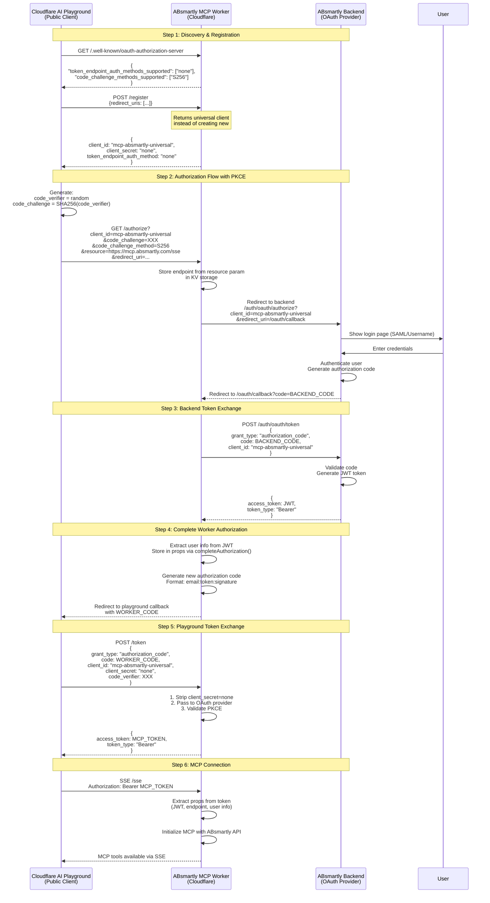

# ABsmartly MCP OAuth Flow Diagram

## Overview

This document describes the complete OAuth flow for the ABsmartly MCP server, including how it handles public clients (like the Cloudflare AI Playground) that use PKCE instead of client secrets.

## Key Concepts

### Public vs Confidential Clients
- **Public Client**: Cannot securely store secrets (e.g., browser-based apps, SPAs)
- **Confidential Client**: Can securely store secrets (e.g., server-side apps)
- Public clients use `token_endpoint_auth_method: "none"` with PKCE

### PKCE (Proof Key for Code Exchange)
- Security mechanism for public clients
- Replaces client secret with dynamically generated code_verifier/code_challenge
- Required by OAuth 2.1 and MCP specification

## Complete OAuth Flow

## Token Types in the Flow

1. **BACKEND_CODE**: Authorization code from ABsmartly backend
2. **JWT**: Access token from ABsmartly backend (contains user auth)
3. **WORKER_CODE**: Authorization code from Cloudflare Worker (format: `email:token:signature`)
4. **MCP_TOKEN**: Final access token for MCP connection

## Why `client_secret: "none"`?

1. Playground is a **public client** (runs in browser)
2. Cannot securely store secrets
3. Uses PKCE for security instead
4. When we return `token_endpoint_auth_method: "none"` in registration, playground sends `client_secret=none` to indicate this auth method

## Security Considerations

1. **PKCE Required**: Public clients must use PKCE
2. **Resource Parameter**: Used to bind tokens to specific MCP server
3. **Token Validation**: Tokens must be validated for correct audience
4. **No Secrets in Public Clients**: Never send real secrets to browser apps

## Current Implementation Notes

- Worker intercepts `/token` requests with `client_secret=none`
- Strips the parameter before passing to OAuth provider
- OAuth provider validates using PKCE instead of client secret
- This allows public clients to authenticate securely